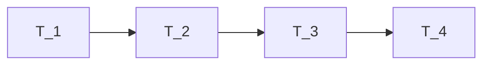

# Introductie

Deze hackathon challenge draait om het synthetiseren van grote, relationele datasets. Het UWV heeft hiervoor 7 tabellen aangeleverd die met elkaar gelinkt kunnen worden aan de hand van keys.

Bij het synthetiseren van de relationele dataset vonden we 3 mogelijke challenges:

1. Relaties behouden in datasets
2. Business rules
3. Tijdsreeksen

In dit document behandelen we stuk voor stuk onze ideeën rondom deze drie challenges.

# 1. Relaties behouden
De UWV data heeft 6 tabellen die allemaal dezelfde composite key gebruiken van de kolommen `IKV_ID`, `HIS_DAT_IN` en `HIS_TS_IN`. Alleen `tabel LA_INKOMSTENOPGAVE` gebruikt deze niet. Van `tabel LA_IKV_IDENTIFICATIE_HIS` vinden we het niet logisch om deze te synthetiseren, aangezien de kolommen verder voornamelijk BSN, loonheffingennummer en personeelsnummer zijn en dit soort persoonsgegevens. Om te synthetiseren starten we vanuit `tabel LA_INKOMSTENPERIODE`.

Om te focussen op alleen de relaties hebben we het concept van tijdsreeks verwijderd, door alleen te filteren op zaken die nu nog lopen (`HIS_DAT_END` = 99991231). Vervolgens hebben we de kolommen `HIS_DAT_END` en `HIS_TS_END` uit alle tabellen gehaald. `Tabel LA_IKV_GELDIGHEID_HIS` bevatte vervolgens bijna alleen maar missende waarden in de kolommen buiten de composite key, dus ook deze tabel is weggelaten. Dan houden we vier tabellen over in onze set. Deze noemen we $T_1$, $T_2$, $T_3$ en $T_4$. Deze zijn:
| Tabel | Naam|
| ----- | -----|
| $T_1$ | LA_INKOMSTENPERIODE|
| $T_2$ | LA_IKV_PERSOON_HIS |
| $T_3$ | LA_IKV_ADRES_HIS |
| $T_4$ | LA_SECTORRISICOGROEP |

Voor de synthesemethode wilden wij kijken of we alles konden reduceren naar tabulaire data, zonder er 1 grote dataset van te maken. De synthpop methode werkt namelijk goed op tabulaire data. De dataset van de UWV kan gezien worden als een stermodel. Zo kunnen alle punten van de ster los gesynthetiseerd worden. Om deze tabellen te kunnen synthetiseren met behoud van relatie hebben we stappenplannen bedacht.  Deze zijn opgedeeld in het synthetiseren van de eerste twee tabellen en alle opvolgende tabellen.

## Eerste twee tabellen synthetiseren
We beginnen met $T_1$ en $T_2$. Hierin definiëren we $T_1=[\text{id}, x_1,\dots, x_n]$, waarin id de primary key is en x een andere kolom. Hetzelfde geldt voor $T_2=[\text{id}, y_1,\dots,y_n]$, alleen is id hier een foreign key. Aan de hand van de volgende stappen creëren we de synthetische versies van $T_1$ en $T_2$:

1. Join de twee tabellen samen op id: $A=[\text{id}, x_1,\dots,x_n,y_1,\dots,y_n]$
2. Synthetiseer deze tabel met synthpop zonder id te synthetiseren. Het model is gefit op $A$ en wordt gebruikt om $x_1,\dots,x_n$ en $y_1,\dots,y_n$ te voorspellen. Zo krijg je $A_{syn}=[x_1,\dots,x_n,y_1,\dots,y_n]$. Hierin zijn alle kolommen de gesynthetiseerde versie.
3. Groepeer $A_{syn}$ op $x_1,\dots,x_n$ en geeft ieder rij een regelnummer. Dit regelnummer is dan een id die uniek is voor iedere mogelijke combinatie van $x_1,\dots,x_n$. De combinaties van de y-kolommen kan wel anders zijn. Dit id is **geen** primary key.
4. Splits de datasets weer op. Met `select distinct id, x_1,...,x_n` vinden we de synthetische dataset van $T_1$: $T_{1 syn}=[\text{id}, x_1,\dots,x_n]$ waarbij id een primary key is. Gebruik op dezelfde manier `select distinct id, y_1,...,y_n` voor $T_{2 syn}=[\text{id},y_1,\dots,y_n]$, waarbij id een foreign key is.

De uitkomst van deze stappen is de gesynthetiseerde versies van $T_1$ en $T_2$.

## Opvolgende tabellen synthetiseren
Voor de tabellen erna kan een for-loop gevolgd worden. Om deze loop uit te leggen gebruiken we $T_3$ als voorbeeld $T_3$ definiëren we als $[\text{id},z_1,\dots,z_n]$. De stappen in de loop zijn als volgt:

1. Join de eerder gesynthetiseerde tabellen weer samen op basis van de keys. In dit geval gaat het dan weer om $T_1$ en $T_2$ en krijg je dus weer $A=[\text{id},x_1,\dots,x_n,y_1,\dots,y_n]$.
2. Join hier de te synthetiseren tabel ($T_3$) bij en krijg zo $B=[\text{id},x_1,\dots,x_n,y_1,\dots,y_n,z_1,\dots,z_n]$
3. Fit het synthese model op $B$ in zijn algeheel.
4. Aangezien $x_1,\dots,x_n,y_1,\dots,y_n$ al gesynthetiseerd is ($A_{syn}$), hoeft dat niet nu weer te gebeuren. Deze kolommen worden overgeslagen bij het voorspellen. Zo wordt het model gebruikt om alleen $z_1,\dots,z_n$ te voorspellen. Zo eindig je met $B_{syn}=[x_1,\dots,x_n,y_1,\dots,y_n,z_1,\dots,z_n]=[A_{syn},z_1,\dots,z_n]$. Hierin staan alle kolommen opnieuw voor hun gesynthetiseerde varianten.
5. Er moet opnieuw een id toegevoegd worden aan deze set. Dit doen we aan de hand van een id lookup. Hiervoor kijken we naar $T_1$ om zo de id te vinden die hoort bij de combinatie $x_1,\dots,x_n$. Dit id voegen we toe aan $B_{syn}$.
6. Om uiteindelijk $T_{3 syn}$ te verkrijgen runnen we een `select distinct id, z_1,...,z_n`. Dan is de synthetische tabel $T_{3syn}=[\text{id},z_1,\dots,z_n]$ waarbij id een foreign key is. De primary key is in $T_{1 syn}$.

Voor de volgende kolom zou dit stappenplan opnieuw gevolgd kunnen worden waarbij je dan $B$ zou maken in stap 1 en daaruit verder te werken, maar het is ook mogelijk om $T_4$ te synthetiseren vanuit alleen $T_1$ en $T_2$. Het synthese proces ziet er dan uit als volgt:


```
graph LR
    T1[T_1] --> T2[T_2]
    T2 --> T3[T_3]
    T2 --> T4[T_4]
```
Dit kan wenselijk zijn om zo computerinspanning te minimaliseren.

# 2. Business rules
Onze synthesemethode Synthpop genereert synthetische data door voor elke variabele een voorspellingsmodel te trainen op basis van de overige variabelen. Standaard wordt hiervoor *classification and regression trees* (CART) gebruikt, oftewel decision trees. Deze bomen leren de conditionele verdelingen in de data; op elk knooppunt wordt een splitsing gemaakt op basis van een variabele, en in de bladeren wordt een kansverdeling geschat waaruit nieuwe waarden worden gesampled.

Het genereren van synthetische data gebeurt sequentieel. Dat wil zeggen: eerst wordt $X_1$ gegenereerd, daarna $X_2$ conditioneel op $X_1$, vervolgens $X_3$ conditioneel op $X_1,X_2$, enzovoort. Op deze manier wordt de gezamenlijke verdeling van de originele data benaderd door een keten van conditionele modellen.

Een belangrijk voordeel van decision trees is dat ze expliciet regelgebaseerd zijn: elk pad in de boom correspondeert met een set *if-then* regels. Dit maakt het relatief eenvoudig om business rules te integreren in het syntheseproces.

In de praktijk kan dit door na het genereren van een record te controleren of deze voldoet aan vooraf gedefinieerde business rules. Records die de regels schenden worden verworpen (*rejection sampling*) en opnieuw gegenereerd. Conceptueel dwing je hiermee extra constraints af bovenop de statistische structuur die de decision trees leren.

Belangrijk is dat deze aanpak neerkomt op het aanpassen van de doelverdeling: je neemt de door synthpop geleerde verdeling $p(x)$ en conditioneert deze impliciet op een set regels $R$, waardoor je feitelijk samplet uit $p(x|R)$. Dit werkt goed zolang de business rules niet te streng zijn. Bij veel complexe regels kan de reject rate hoog worden, wat leidt tot inefficiënte of vertekening.

Een alternatief is om de rules direct in de boomstructuur te verwerken, bijvoorbeeld door bepaalde splitsingen te forceren of onmogelijk gemaakte paden te blokkeren. In dat geval embed je de business logica in het model zelf in plaats van in een post-processing stap. Dit is conceptueel sterker, maar praktisch lastiger te implementeren.


# 3 Tijdsreeksen

Onze aanpak voor tijdsreeksen is om tijdsreeksen te transformeren naar tabulaire data. In deze code doen we dit door middel van een Principle Component Analysis (PCA).  
Concreet beteken dat we een matrix maken waarbij we een kolom maken voor elk persoon, en een rij voor elk tijdstip. Op die manier krijgen we een lange "smalle" matrix. 
Daar bereken we de principle components van. Dat zijn een soort basis tijdsreeksen. 
Door vervolgens elke individuele tijdsreeks te schrijven als een lineaire combinatie van die basis tijdsreeksen, kunnen we elke tijdreeks vastleggen met een aantal getallen die geen tijdsreeks meer zijn. 
Vaak kan het met veel minder getallen dan het aantal meetpunten per tijdsreeks. 

Die coordinaten zijn tabulaire data, waar we CART voor gebruiken. Uit dat proces komt dan ook tabulaire data.
In dit geval synthetische versie van die coordinaten. Die kunnen we dan terug transformeren naar een tijdsreeks (inverse PCA).

Omdat de tijdsreeksen niet allemaal tegelijk beginnen, is de matrix waar we PCA op toepassen op veel plekken leeg. Voor nu hebben we leeg ingevuld met 0.
Dit heeft effect op klassieke PCA. 

Als we meer tijd zouden hebben, dan zouden we aanpassingen van PCA onderzoeken, of andere transformaties. 
Er zijn namelijk versies van PCA en andere algorithmes die aangepast zijn voor matrices met veel nullen. Met name zogenaamde "sparse" algorithmen zijn interessant om te onderzoeken.